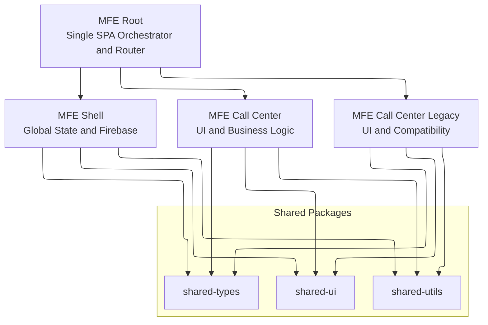
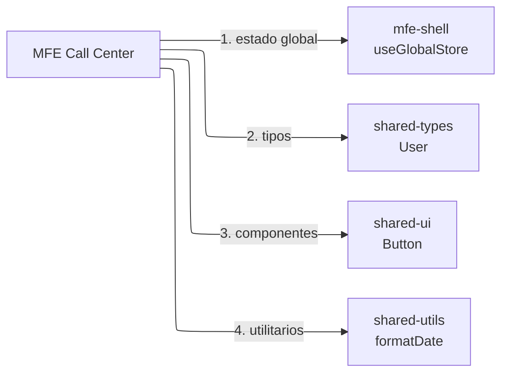
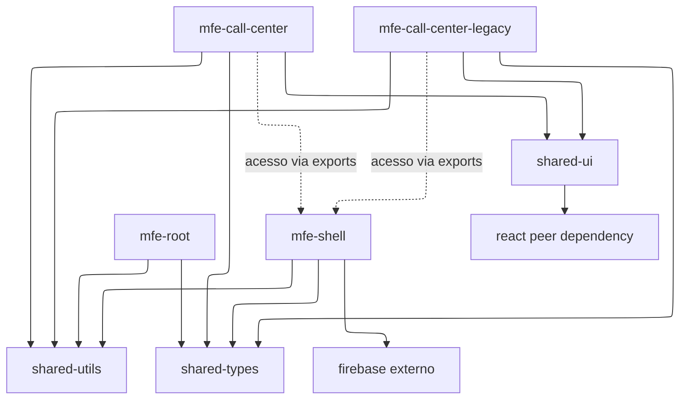

# Arquitetura do Monorepo MFE

## 📊 Visão Geral

Arquitetura de microfrontends descentralizados com orquestração centralizada via Single SPA.



## 🏗️ Camadas

### 1. **Entrada (MFE Root)**
- Ponto de entrada único da aplicação
- Orquestração de microfrontends via Single SPA
- Roteamento principal
- Carregamento dinâmico de MFEs

### 2. **Camada de Aplicação**

#### MFE Shell (Crítico)
- **Responsabilidades:**
  - Gerenciar estado global (Zustand store)
  - Encapsular adapters de feature toggle e allow list
  - Integrar providers locais hoje e Firebase/API no futuro
  - Context providers para toda a aplicação
  - Avaliar acesso por feature e bloquear rotas canary em runtime
  - Theme & internacionalização (futura)

- **Exposições Públicas:**
  ```typescript
  export { useGlobalStore } from './store/globalStore'
  export { AppStateProvider } from './app-state/providers/AppStateProvider'
  export { useFeatureToggle } from './feature-flags/hooks/useFeatureToggle'
  export { useFeatureAccess } from './feature-flags/hooks/useFeatureAccess'
  export { useRouteAccess } from './feature-flags/hooks/useRouteAccess'
  ```

#### MFE Call Center
- **Responsabilidades:**
  - Nova interface de call center
  - Gerenciamento de chamadas
  - Painel de agentes

#### MFE Call Center Legacy
- **Responsabilidades:**
  - Compatibilidade com interface antiga
  - Será descontinuado

### 3. **Camada de Componentes & Utilidades (Shared Packages)**

#### shared-ui
- Componentes React reutilizáveis
- Sem lógica de negócio
- Stateless ou hooks locais apenas
- Exemplo: Button, Modal, Card, Table

#### shared-utils
- Funções puras
- Helpers e formatadores
- Integração com APIs externas
- Firebase service functions

#### shared-types
- TypeScript interfaces
- Tipos compartilhados
- Contratos de dados
- Não exporta implementações

## 🔄 Fluxo de Comunicação



## 📦 Dependências Entre Packages



## 🎯 Padrões de Integração

### 1. **Entre MFEs via Single SPA Props**
```typescript
import { registerApplication } from 'single-spa'

// single-spa v4: assinatura (name, app, activeWhen)
registerApplication(
  '@call-center-platform/mfe-shell',
  () => System.import('@call-center-platform/mfe-shell'),
  () => true
)
```

### 2. **Via Shared Packages (Recomendado)**
```typescript
// Qualquer MFE pode importar
import { useGlobalStore } from '@call-center-platform/mfe-shell'
import { Button } from '@call-center-platform/shared-ui'
import type { User } from '@call-center-platform/shared-types'
```

### 3. **Via Context & Providers**
```typescript
// mfe-shell fornece providers e guarda a troca de implementação
<AppStateProvider>
  <App />
</AppStateProvider>
```

### 4. **Via Adapters de Access Control**
```typescript
// Implementação atual: mock/local
new LocalFeatureToggleAdapter()
new LocalAllowListAdapter()

// Evolução futura sem mudar consumidores
new FirebaseFeatureToggleAdapter()
new ApiAllowListAdapter()
```

O shell mantém a decisão visual e o bloqueio de canary por rota. O mfe-root continua responsável apenas pelo bootstrap estático via env e não deve depender de contexto de usuário ou fonte assíncrona de acesso.

## 🔐 Limites de Responsabilidade

### MFE Root NÃO DEVE:
- ❌ Conter lógica de negócio
- ❌ Conter componentes UI
- ❌ Conter estado global

### MFE Shell NÃO DEVE:
- ❌ Conter componentes específicos de domínio
- ❌ Conter lógica de call center
- ❌ Ser roteado individualmente

### Shared Packages NÃO DEVEM:
- ❌ Depender de outras shared packages (evitar ciclos)
- ❌ Conter lógica específica de feature
- ❌ Conter estado global

## 📈 Escalabilidade

### Adicionar novo MFE:
1. Criar diretório em `apps/mfe-novo`
2. Copiar `package.json`, `tsconfig.json`, `vite.config.ts`
3. Criar `src/index.ts` e `src/App.tsx`
4. Registrar em `mfe-root`

### Adicionar novo shared package:
1. Criar diretório em `packages/novo-package`
2. Criar `package.json`, `tsconfig.json`
3. Adicionar ao workspace no `package.json` raiz
4. Exportar do `src/index.ts`

## 🚀 Deploy Strategy

### Monolítico (Recomendado inicialmente):
- Build tudo junto
- Deploy único bundle

### Distribuído (Futuro):
- Cada MFE com pipeline próprio
- Versioning independente
- CDN para cada app

## 📝 Convenções

- **Nomes**: `mfe-` prefix para apps, `shared-` para packages
- **Tipos**: Suffix `-Types` ou interfaces em `shared-types`
- **Exports**: Sempre use named exports em packages compartilhados
- **Versioning**: Semver para packages compartilhados
